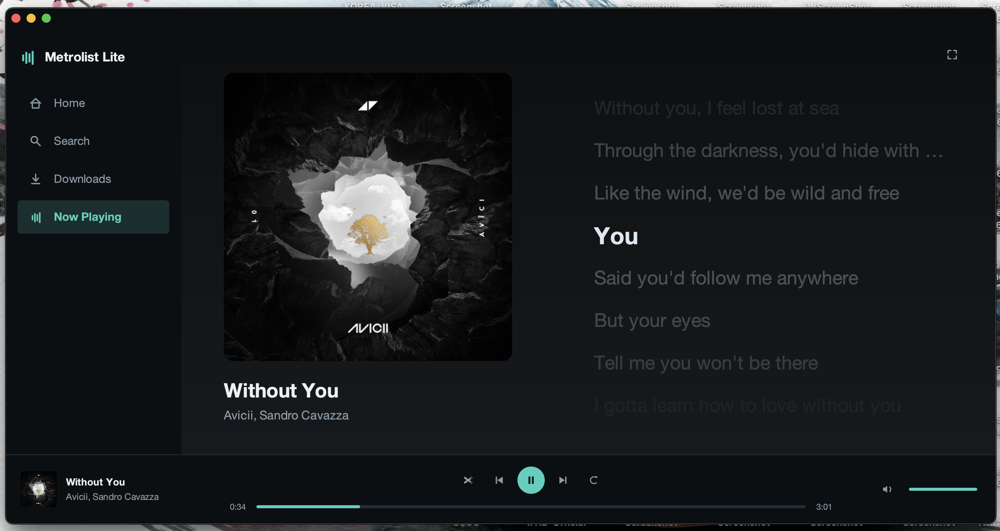
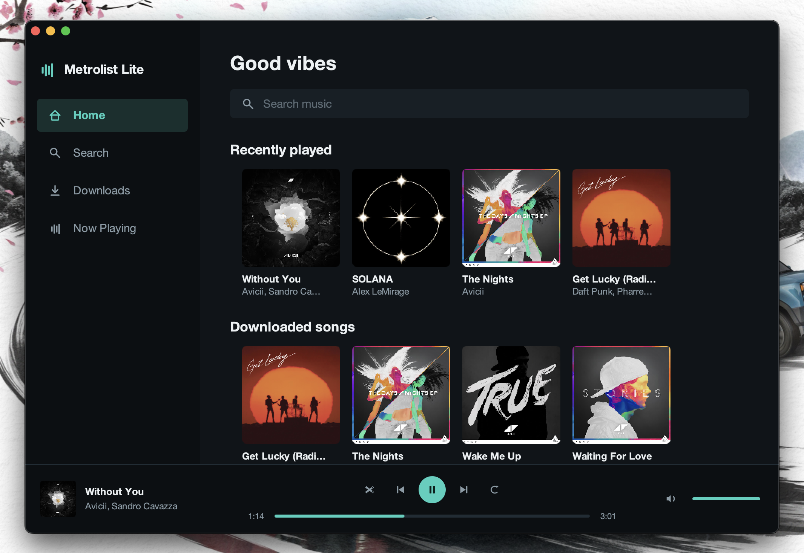
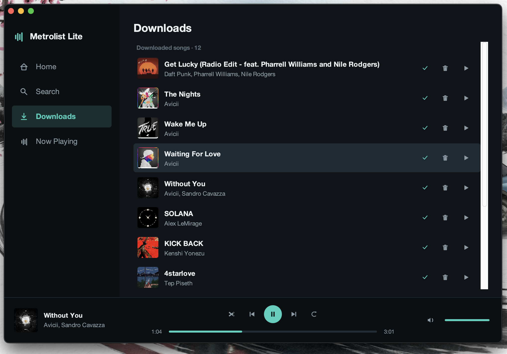

# Metrolist Lite

[](https://github.com/error9098x/metrolist-lite/actions/workflows/desktop-release.yml)
[](https://github.com/error9098x/metrolist-lite/releases)
[](https://github.com/error9098x/metrolist-lite/releases)
[](LICENSE)


[](https://github.com/error9098x/metrolist-lite/stargazers)
[](https://github.com/MetrolistGroup/Metrolist)

A native **macOS desktop music player** for YouTube Music — search, play, synced
word‑by‑word lyrics, and offline downloads — in a clean dark, Apple‑Music‑style UI.

Metrolist Lite is a **fork of [Metrolist](https://github.com/MetrolistGroup/Metrolist)**
(an Android YouTube Music client). Metrolist focuses on Android; this fork adds a
cross‑platform‑friendly desktop app that **reuses Metrolist's pure‑Kotlin modules**
(`innertube`, `lrclib`, `betterlyrics`) for the heavy lifting.

> Status: personal‑use MVP for macOS. Works today; rough edges expected.

---

## Screenshots

<p align="center">
  
  <br><em>Now Playing — album‑art gradient backdrop with live, word‑by‑word synced lyrics.</em>
</p>

<p align="center">
  
  
  <br><em>Home — search, recents &amp; downloaded songs &nbsp;·&nbsp; Downloads — offline library with progress, play &amp; remove.</em>
</p>

---

## Features

- 🔎 **Search** YouTube Music songs
- ▶️ **Playback** via `mpv` (+ `yt-dlp`) — keeps playing when the window is minimized
- 🎤 **Lyrics** — line‑synced (LRCLIB) and **word‑by‑word** karaoke (BetterLyrics/TTML),
  with a smooth pastel gradient sweep
- ⬇️ **Downloads** — save audio **and** lyrics + cover art for **offline** playback
- 🎚️ Queue, shuffle, repeat, seek, volume
- 🖼️ **Now Playing** with album‑art gradient background and a distraction‑free
  fullscreen "Zen" mode

## Requirements

- macOS (Apple Silicon or Intel)
- JDK 21+ (the build targets Java 21 bytecode)
- [`mpv`](https://mpv.io) and [`yt-dlp`](https://github.com/yt-dlp/yt-dlp):

  ```bash
  brew install mpv yt-dlp
  ```

## Run

```bash
./gradlew :desktop-lite:run
```

Downloads are stored under `~/.metrolist-lite/downloads/` (audio + `.lyrics.json` +
cover), with an index that persists across restarts.

## Architecture

The desktop app lives in the **`desktop-lite/`** module — a pure Kotlin/JVM Swing
`application`. It does **not** depend on the Android library projects; instead it
compiles the reusable pure‑Kotlin sources directly:

| Reused module | Purpose |
|---|---|
| `innertube` | YouTube Music search + player API |
| `lrclib` | LRCLIB line‑synced lyrics |
| `betterlyrics` | Word‑by‑word (TTML) lyrics |

Inside `desktop-lite/` the code is organized by responsibility (search, stream
resolution, playback, lyrics, downloads, UI) behind small interfaces. Playback is
delegated to the external `mpv` process; stream/lyrics resolution is offline‑first
for downloaded songs.

## Relationship to upstream Metrolist

This repository is a **fork** kept intentionally close to upstream so module fixes
(e.g. when YouTube changes) can be pulled in:

```bash
git remote add upstream https://github.com/MetrolistGroup/Metrolist
git fetch upstream
git merge upstream/main   # or cherry-pick module changes
```

The original Metrolist (Android) README is kept as
[`README.metrolist.md`](README.metrolist.md).

**Retained upstream files:** the Android app (`app/`), Fastlane, store assets and
other modules from Metrolist are kept in the tree for module reuse and to keep
upstream sync simple. They are not used by the desktop app and may be trimmed later.

## Releases

Tagged releases publish a self‑contained macOS `.dmg` (built with `jpackage` on a
macOS CI runner) under [Releases](../../releases). Push a tag like `v1.0.0` to trigger
the **Desktop Release (DMG)** workflow, or run it manually from the Actions tab.

Build a DMG locally:

```bash
scripts/package-dmg.sh 1.0.0   # -> build/dist/Metrolist Lite-1.0.0.dmg
```

The bundle ships its own Java runtime, so end users only need `mpv` and `yt-dlp`
(`brew install mpv yt-dlp`). DMGs are unsigned for now — first launch may need
right‑click → Open (Gatekeeper).

## License

GPL‑3.0, inherited from Metrolist. See [`LICENSE`](LICENSE). All credit for the
`innertube` / `lrclib` / `betterlyrics` modules and the original project goes to the
[Metrolist](https://github.com/MetrolistGroup/Metrolist) authors.
